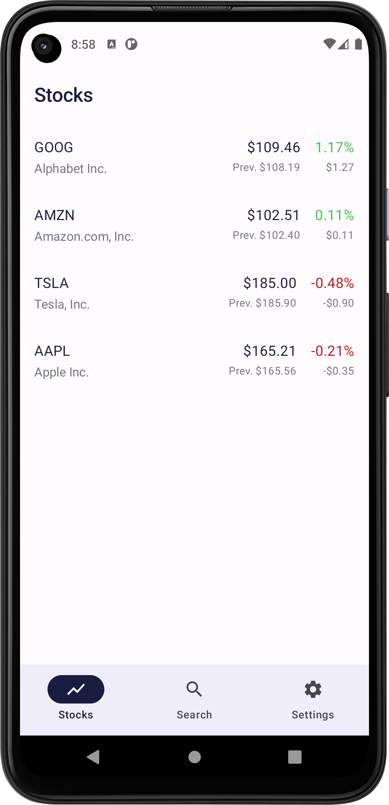
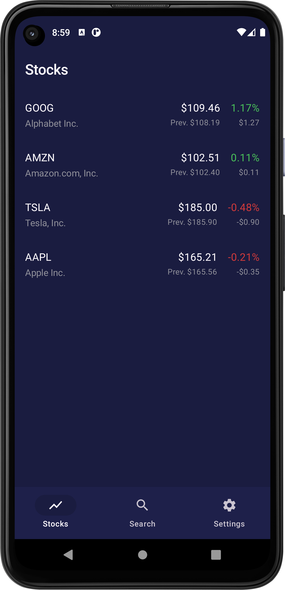

# Stocks

A very simple app for tracking the stock market using the Yahoo Finance API. This is an educational
project for learning and exploring modern Android development architecture.

## Images

| Light               | Dark              |
|---------------------|-------------------|
|  |  |

## Features

- Data from Yahoo Finance
- Auto refresh every 30s
- Material 3
- Swipe to Dismiss
- Pull to Refresh
- Dark mode

## Stack

- Jetpack Compose
- MVVM + Coroutines + Flow
- DI with Hilt + Dagger
- Room and DataStore with protobuf
- OkHttp + Retrofit + KotlinX Serialization
- Unit and Instrumented Tests (for now, only the DAO)
- Firebase Test Lab

## To-do

- [ ] Instrumented test for UI
- [ ] Add a screen with detailed information and candlestick chart